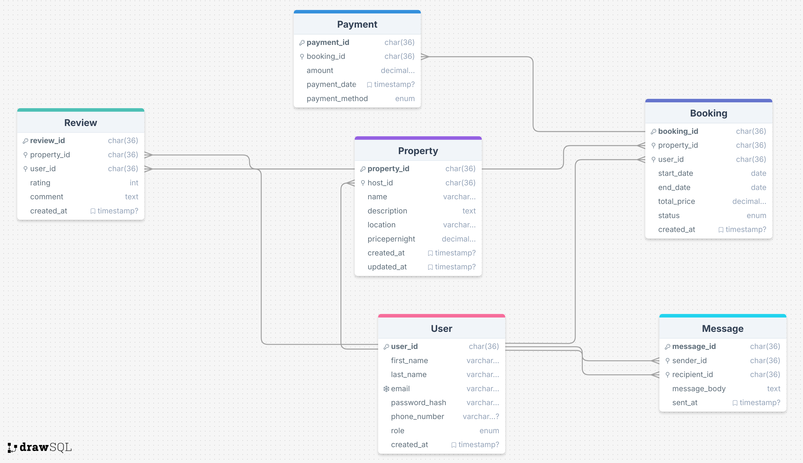

# Airbnb Clone Backend – Software Requirements Specification (SRS)

# 📌 Introduction

### Purpose

This document outlines the software requirements for the backend of the Airbnb Clone web application. It defines the core functionalities, technical implementation details, and non-functional aspects required to build a robust, secure, and scalable backend system.

### Scope

The backend will handle server-side logic, database operations, and API integrations for user management, property listings, bookings, payments, notifications, and administration. It will expose RESTful APIs for frontend consumption.

### Intended Audience

- Backend Developers
- Frontend Developers
- QA Engineers
- DevOps Engineers
- Project Managers

### Definitions and Acronyms

- **JWT**: JSON Web Token
- **RBAC**: Role-Based Access Control
- **API**: Application Programming Interface
- **REST**: Representational State Transfer
- **OAuth**: Open Authorization

---

## 🧩 Core Functionalities

### 1. User Management

- **User Registration**: Guests and hosts can sign up.
- **Authentication**: Email/password login with JWT and OAuth (Google, Facebook).
- **Profile Management**: Update photo, contact info, and preferences.

### 2. Property Listings Management

- **Add Listings**: Hosts can create listings (title, description, location, price, amenities, availability).
- **Edit/Delete Listings**: Hosts can update or remove listings.

### 3. Search and Filtering

- Filter listings by:
    - Location
    - Price range
    - Number of guests
    - Amenities (Wi-Fi, pool, pet-friendly)
- Pagination for large datasets.

### 4. Booking Management

- **Booking Creation**: Guests book properties for specific dates with double-booking prevention.
- **Cancellation**: Guests and hosts can cancel based on policy.
- **Booking Status**: Track statuses (pending, confirmed, canceled, completed).

### 5. Payment Integration

- Use Stripe or PayPal for:
    - Guest payments
    - Automatic host payouts
    - Multi-currency support

### 6. Reviews and Ratings

- Guests leave reviews and ratings.
- Hosts can respond.
- Reviews tied to bookings to prevent abuse.

### 7. Notification System

- Email and in-app notifications for:
    - Booking updates
    - Cancellations
    - Payment changes

### 8. Admin Dashboard

- Admin interface to manage:
    - Users
    - Listings
    - Bookings
    - Payments

---

## 🛠 Technical Requirements

### 1. Database Management

- Use **PostgreSQL** or **MySQL**
- Core tables:
    - Users
    - Properties
    - Bookings
    - Reviews
    - Payments

### 2. API Development

- RESTful API endpoints using:
    - GET, POST, PUT/PATCH, DELETE
- Optional: GraphQL for complex data fetching

### 3. Authentication and Authorization

- Secure sessions using **JWT**
- Role-Based Access Control (RBAC) for:
    - Guests
    - Hosts
    - Admins

### 4. File Storage

- Store images (profile, property) using AWS S3 or Cloudinary

### 5. Third-Party Services

- Email notifications via SendGrid or Mailgun

### 6. Error Handling and Logging

- Implement centralized error handling
- Structured logging for API requests

## System Architecture

### DataBase Schema

### System Flow

---

## 🚀 Non-Functional Requirements

### 1. Scalability

- Modular backend architecture
- Support horizontal scaling with load balancers

### 2. Security

- Encrypt sensitive data (passwords, payments)
- Use firewalls and rate limiting

### 3. Performance Optimization

- Use Redis for caching frequently accessed data
- Optimize SQL queries

### 4. Testing

- Unit and integration tests using `pytest`
- Automated API testing suite

---

## ✅ Summary

This backend is designed to replicate the essential features of Airbnb while ensuring high performance, security, and maintainability. The modular structure and use of industry best practices make it suitable for real-world deployment and future scalability.