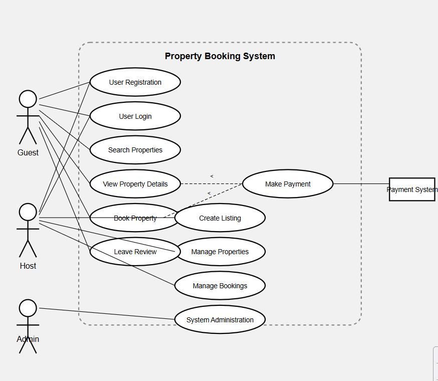

# Airbnb Clone Backend – Use Case Summary

## 👤 Actors
- **Guest**: User who books properties
- **Host**: User who lists properties
- **Admin**: System administrator
- **External Services**: Payment Gateway (e.g., Stripe), Email Service (e.g., SendGrid)

---

## 🎯 Guest Use Cases
- ✅ Register an account
- ✅ Log in via email/password or OAuth (Google/Facebook)
- 🔍 Search for listings
- 🔎 Filter results by location, price, guests, amenities
- 🏘️ View property details
- 📅 Book a property with date validation
- ❌ Cancel booking
- 💳 Make payment through payment gateway
- ✍️ Leave a review
- 🔔 Receive email and in-app notifications
- 📜 View booking history

---

## 🎯 Host Use Cases
- ✅ Register as a host
- ✅ Log in via email/password or OAuth
- 🏠 Create property listings
- 🛠️ Edit or delete listings
- 📆 View bookings for own properties
- ❌ Cancel a booking
- 💬 Respond to guest reviews
- 💰 Receive automatic payouts
- 🔔 Receive notifications for bookings and payments

---

## 🎯 Admin Use Cases
- 👥 View and manage all users
- 🏘️ View and manage all property listings
- 📊 View and manage all bookings
- 💳 Monitor and manage payments
- 📝 Moderate reviews and ratings
- 🛡️ Monitor system activity/logs

---

## 🔌 External Services Use Cases
- 💳 **Payment Gateway**
  - Process guest payments
  - Initiate host payouts

- 📧 **Email Service**
  - Send email notifications (bookings, cancellations, payments)
